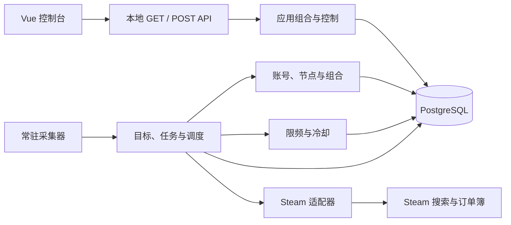

# 系统架构

buff-go 是 Go 模块化单体。一个进程同时提供本地 API、嵌入式 Vue 控制台和常驻采集器；PostgreSQL 保存配置、任务库存、限频状态、行情事实和恢复状态；Steam 是当前唯一外部采集系统。

## 模块边界

| 模块 | 职责 |
| --- | --- |
| `cmd/buffgo` | 读取启动参数和系统信号 |
| `app` | 连接数据库、执行迁移、装配控制面和采集器、管理进程生命周期 |
| `api` | 提供本地 GET 查询与 POST 操作，执行 Host、同源和 CSRF 校验 |
| `resource` | 管理平台账号、节点、出口证据、账号节点组合和运行时占用 |
| `collection` | 管理采集目标、任务库存、组合认领、执行状态和恢复 |
| `ratelimit` | 定义并执行多维度限频与冷却 |
| `market`、`catalog` | 定义商品身份、方向、金额、行情和写入顺序 |
| `platform/steam` | 执行 Steam 搜索分页、订单簿读取、会话验证和结果转换 |
| `storage/postgres` | 持久化领域状态，并提供事务、认领和恢复能力 |
| `webui` | 提供嵌入 Go 二进制的控制台静态资源 |

领域模块不直接依赖 HTTP 页面；Steam 适配器和 PostgreSQL 是领域端口的具体实现。

## 启动与关闭

启动按以下顺序进行：

1. 连接 PostgreSQL 并执行尚未应用的迁移。
2. 把 Steam 必需的限频策略收敛到 PostgreSQL。
3. 创建资源协调器、控制服务、Steam 采集适配器和常驻采集器。
4. 采集器取得 PostgreSQL 单实例锁，把所有遗留认领恢复为待执行，并完成尚未收敛的停止操作。
5. 本地 API 和控制台开始对外提供服务，采集器按固定周期执行。

关闭时先停止本地 HTTP 接入，再取消并等待采集器完成锁校验、停止收敛和实例锁释放。目标、任务、冷却和行情保留在 PostgreSQL，下一次启动继续恢复。

## 采集执行

采集目标按“Steam 游戏 + 方向”区分。开启方向或修改采集条件会推进开关版本、清空未完成任务并重置下一扫描位置，已经提交的行情继续保留。

常驻采集器为每个可运行方向持续准备待执行任务：

- 出售方向按 Steam 搜索页准备任务，每页 10 个结果，负责发现商品并写入标准目录。
- 求购方向按现有目录逐个准备任务，每个任务读取一个商品的订单簿。

一个账号和一个节点构成执行组合。组合可工作时，账号必须未失效，节点必须具有未过期的出口证据，且 Steam 节点地域必须为 `foreign` 或 `hongkong`。每个组合和每个账号同时最多执行一条任务；同一节点可以按平台并行使用，当前只有 Steam 采集适配器。任务只是持久库存，实际吞吐由当时成功占用资源并领到任务的独立组合数决定。

调度器先取得实际独立的组合租约并领任务，再按平台与接口把 `N` 个真实工人的准入槽以 `T/N` 间隔铺开；这层只避免同时起跑，不是平台总限频。任务执行彼此独立，任一组合完成后立即续领，不等待整批或最慢代理。每个真实 Steam HTTP 请求随后必须通过“接口 + 账号 + 出口 IP”的 PostgreSQL 持久准入。遇到 429 时，任务回到库存，只冷却命中的接口、账号与出口 IP 组合。

## 状态与恢复

方向同时保存使用者期望和后台实际状态。开启后先进入 `starting`，执行条件满足后进入 `running`。单个组合的临时网络失败只会让任务回队并对该组合短暂退避，不会暂停同方向的其他健康组合；资源、限频或配置条件暂不满足时进入 `blocked`。带下次检查时间的阻塞自动复查，没有下次检查时间的阻塞需要修正配置后重新启用。

关闭方向时先进入 `stopping`。系统清空未完成任务，并通过开关版本拒绝属于旧启停周期的在途结果，最终收敛为 `stopped`。

Steam 会话失效后，对应账号变为 `invalid`，该账号停止领任务。使用者替换 Cookie 后账号回到 `unverified`，下一次成功采集会将其验证为 `valid`。

运行期间超过认领时限的任务自动回到待执行集合。进程启动时全部遗留认领回队；配置、下一扫描位置、冷却、行情和已提交写序继续保留。

常驻实例使用 PostgreSQL 会话锁，并每 2 秒验证一次。取得锁时会原子推进持久 owner 代次；入队、认领、回收、提交、完成、回队、状态迁移和限频准入都在事务内校验该代次。继任实例推进代次时会等待已经进入旧代次事务的写入结束，接管成功后旧实例不能再开始上述写入。认领代次另外拒绝已经被重新认领任务的旧结果；watchdog 负责尽快取消失锁进程中的本地执行。

## 事务与投递语义

以下变化各自在明确的事务边界内完成：

- 目标开关、采集条件、开关版本和未完成任务清理。
- 新任务入库和下一扫描位置推进。
- 批次对应的商品目录、映射、媒体、最近提交摘要、最新尝试、最近有效价、变价和提交写序。

任务认领使用跳过已锁任务的数据库认领方式；数据库唯一约束保证一个组合最多拥有一条认领。

页面写入与任务完成标记彼此分开，因此任务采用 at-least-once 投递。若进程在页面写入成功后、任务完成标记前中断，同一任务可以再次执行并产生新的提交写序。

结果先比较方向的开关版本，再比较真实 HTTP 发送前的持久准入时间；提交写序只用于打破同一微秒内的平局。这样较早发出但较晚返回的请求不能回滚行情。每个方向只保留最近成功提交的一个采集批次：ask 批次是一页搜索结果，bid 批次是一个商品的订单簿摘要。最新尝试、最近有效价和价格变化分别保存，变价查询窗口为最近 30 天。

页提交同时校验 owner 代次、认领代次以及任务仍由发起提交的组合持有，避免实例锁交接后旧执行者写入新执行者的认领结果。

## 限频

限频引擎支持平台、接口、账号、IP、账号与 IP 组合五种状态维度，账号与 IP 规则还可以限定接口。当前 Steam 的出售搜索和求购订单簿各有一条“接口 + 账号 + 出口 IP”最小间隔规则，彼此不共享平台总额度；两个独立组合因此可以获得两份请求能力。当前固定间隔为 2 秒，429 固定冷却回退为 60 秒；它们是保守运行参数，不是已经证明的 Steam 绝对边界。限频状态与冷却保存在 PostgreSQL，进程重启后继续生效。

## 控制面与交付

HTTP 服务只允许显式回环监听地址，并校验请求 Host。读取使用无副作用 GET；修改使用 JSON POST，并要求同源 Origin、控制会话 Cookie 和 CSRF 令牌。账号会话、代理认证和代理商凭据只在创建或替换时提交，查询不回显原文。

前端源码由 Vite 生成生产资源并嵌入 Go。项目构建脚本先刷新嵌入资源，再运行完整测试，并在临时目录验证 Go 程序可以编译；运行时只需要一个包含前端资源的可执行文件。
