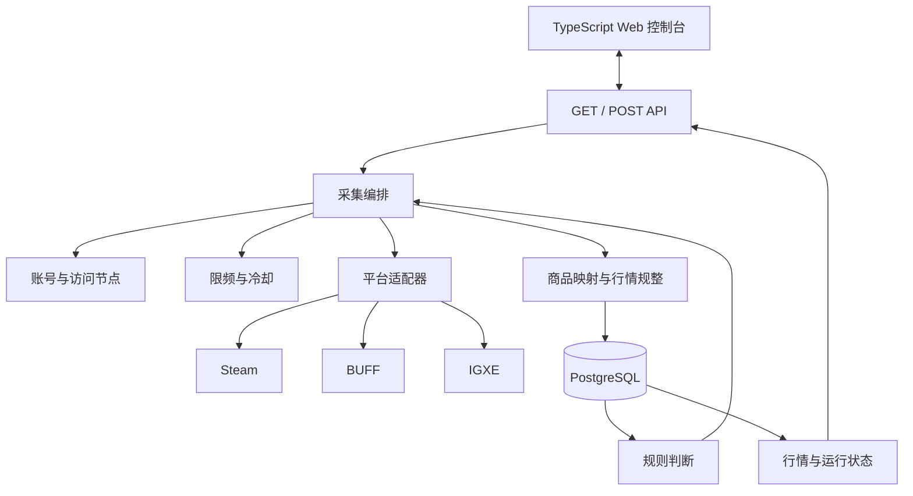

# 系统架构

本文定义 buff-go 的目标技术架构，不表示当前代码已经实现全部能力。产品目标与业务主线见根目录 [README.md](../README.md)，跨平台稳定术语见 [REFERENCE.md](./REFERENCE.md)，Web 操作流程见 [CONSOLE.md](./CONSOLE.md)，平台接口事实见 [`platforms/`](../platforms/README.md)，实施顺序见 [`todo.md`](../todo.md)。

## 从启动到可用行情

一次正常运行按以下顺序完成：

1. 单个 Go 进程从 PostgreSQL 恢复采集开关、账号、访问节点、平台分配、冷却状态和未完成运行。
2. 使用者通过 Web 控制台调整平台与方向开关，并明确配置账号、访问节点和执行组合。
3. 采集编排器为已开启的 Steam 商品目录同步生成目录任务，并为已开启的“平台 + 求购或出售”生成摘要任务。
4. 资源调度器为一个页面请求选择可用的登录账号和访问节点；限频控制器判断该组合是否可以请求目标接口。
5. 平台适配器分页采集列表，每完成一页就把原始引用、规整行情、下一页游标和覆盖范围一起提交。
6. 使用者可以读取最新行情，同时看到数据时间、运行状态和覆盖完整性；部分采集不会冒充完整结果。
7. 规则命中摘要行情后，系统先检查对应平台与方向的详情能力；已验证并实现时才创建幂等详情任务，否则只记录详情不可用。
8. 停止、失败或进程重启后，系统保留已经提交的数据，并根据持久化状态结束、重试或创建新一轮采集。

## 总体结构



系统采用模块化单体：API、调度、采集、规整和规则运行在同一个进程中。进程内负责执行与短期占用，PostgreSQL 负责需要跨重启保留的业务事实和运行状态。目标架构不使用 Redis；当前 Redis 租约与限频实现只作为迁移期间的旧路径保留。

Web 控制台使用 Vue 3、TypeScript 和 Vite，源码位于根目录 `web/`。构建产物生成到 `internal/webui/dist/` 并嵌入 Go 可执行文件；生产环境不运行 Node 服务。前后端通过同源 GET 查询和 POST 操作接口协作，控制台不直接访问 PostgreSQL，也不直接调用平台接口。

## 模块边界

| 模块 | 只负责什么 | 不负责什么 |
| --- | --- | --- |
| `app` | 启动配置、依赖装配、进程启动与关闭 | 平台业务规则和运行时采集配置 |
| `api` | GET 查询、POST 操作、输入校验 | 直接请求交易平台 |
| `catalog` | Steam 标准商品和平台商品映射 | 行情采集与比较 |
| `market` | bid/ask、金额、数量、时间和状态契约 | HTTP 与持久化实现 |
| `collection` | 目录、摘要、详情三类任务及其开关、运行批次、分页、停止和恢复 | 平台字段解析 |
| `resource` | 账号、访问节点、平台分配和运行时占用 | 具体平台限频数字 |
| `ratelimit` | 多限制维度的准入与冷却 | 代理分配和平台响应解析 |
| `rule` | 读取有效摘要并产生详情任务 | 绕过编排器直接采集 |
| `platform/*` | 登录、请求、分页、响应转换和平台错误识别 | 全局开关、资源分配和规则 |
| `storage/postgres` | 持久化上述领域状态 | 定义业务语义 |
| `telemetry` | 运行状态、失败原因和资源可用性 | 改变业务结果 |
| `webui` | 嵌入并提供已经构建的 Web 静态文件 | 页面业务、数据库访问和采集逻辑 |

接口定义靠近使用方。平台适配器依赖稳定领域契约，领域模块不依赖具体平台、HTTP 客户端或数据库实现。

启动配置只包含 PostgreSQL 连接、监听地址、凭据加密密钥和日志等进程启动必需信息。平台账号、访问节点、采集开关、周期、分配和限频策略都是运行时业务状态，统一从 PostgreSQL 读取，不再同时维护配置文件来源。

## 采集编排

### 商品目录同步

Steam 商品目录同步是独立的 `catalog` 任务类型，不带 bid/ask。一个目录目标由 `(steam, appid)` 标识，有自己的启用状态和周期，不受 Steam 求购或出售开关控制。首次配置账号节点组合并启用目标后可以立即触发一次，之后按周期发现新增或变化的 Steam 商品。

目录任务仍然经过 Steam 账号节点组合、地域、限频、逐页提交和重启恢复。运行与概览必须展示其等待、运行、阻塞、失败、分页覆盖和最近成功时间，不能把目录同步隐藏成启动过程。

“立即同步”只允许用于已启用目录目标。同一目标已有活动运行时，POST 返回已有运行而不是并行创建第二轮；没有活动运行时才创建新运行。周期修改从下一轮生效，不中断当前运行。

### 摘要采集

摘要任务由“平台 + 方向 + 采集范围”唯一描述。编排器在每次请求前重新检查开关版本、资源占用和限频状态，防止关闭任务后继续派发新页面。页面返回后、提交当前行情前必须再次确认开关版本仍然一致；关闭后才返回的数据可以保留为诊断证据，但不能发布为当前行情。

每一页是最小提交单元：页面响应经过商品映射、币种和字段语义校验后再进入当前行情。后续页面失败不会回滚已提交页，但本轮覆盖完整性必须标为 `partial`。只有完整覆盖的运行才能据此判断某个未出现商品在本轮不存在。

当前行情以“Steam 标准商品 + 平台 + 方向”唯一定位。存储层分别保存最新采集尝试和最近有效价格：显式 `empty`、`unavailable` 或 `failed` 可以成为最新尝试状态，但旧价格只保留为带时间的历史值。页面失败或部分运行只影响已经明确尝试的商品和运行完整性，不得把未覆盖商品批量标成失败或为空。

每个方向开关版本和采集运行使用单调递增序号。发布当前行情时必须同时校验开关版本、运行序号和页面序号；已关闭版本、较旧运行或迟到页面可以保留为诊断证据，但不能覆盖较新的最新尝试或有效价格。

### 详情采集

详情任务只能由明确规则触发，并固定平台、Steam 标准商品和 bid/ask 方向。创建前必须确认该“平台 + 方向”的详情接口已经验证且适配器已经实现；否则只保存规则命中并标记 `detail_unavailable`。相同规则版本与摘要版本不能重复创建同一任务。

详情分页同样逐页提交。中断后保留已完成订单，但部分快照不能覆盖最近一次完整快照，也不能被读取端解释为完整订单簿。

### 停止与重新开启

关闭一个摘要方向或目录目标时，编排器停止创建该目标的新任务，取消其正在等待或执行的请求，并先把实际状态设为 `stopping`。待该目标的任务、在途请求和执行占用释放后，相关运行原因才标为 `stopped`；已提交页面继续保留，覆盖完整性独立记录为 `complete` 或 `partial`。关闭一个目录目标不影响其他 `appid` 或 Steam bid/ask。

再次开启时始终创建新的摘要运行，动态市场数据不会跨越关闭时间段继续拼接。游标恢复只适用于进程异常重启，并且平台游标已经被证明属于同一轮稳定快照；否则从新一轮第一页开始。

## 资源与限频

访问节点包括本机直连、国内、国外和香港节点。本机直连也必须声明地域能力，不能绕过调度。

首版只接收静态出口或能够维持粘性会话的代理。节点验证时请求受控的出口检测服务并保存实际出口 IP、验证时间和 `valid_until`；有效期不能超过已知粘性会话寿命，本机直连同样处理。IP 和“账号 + IP”限频以实际出口 IP 为键，而不是访问节点 ID。多个节点解析为同一出口时共享预算和冷却。

调度前发现验证过期、代理地址或凭据变化、粘性会话重建时，节点先进入 `validating` 并停止派发；新出口确认前视为不可用，相关采集目标显示 `blocked`。确认变化后旧 IP 状态保留审计，新请求只使用新 IP 状态。无法稳定确认出口时，节点标为 `unavailable`，不能进入可用组合。

节点按平台独占分配。一个节点分配给 Steam 后，只有使用者明确解除并重新分配，才能用于 BUFF 或其他平台。同一平台的求购与出售共享该平台的账号、节点和总限频预算。

一个页面请求从准入检查开始到响应处理结束，独占一个“平台账号 + 访问节点”组合；处理完成后立即释放，采集运行不会在页面间空等时持续占用组合。第一阶段同一账号只允许一个活动节点，同一节点同时只执行一个页面请求。限频状态分别支持平台、接口类别、账号、IP 和账号与 IP 组合；平台错误只更新能够被证据支持的限制范围。

平台总预算覆盖该平台的目录、摘要、详情等全部外部请求，不按 bid/ask 拆分。每次请求既要有启用的平台速率策略，也要命中该接口类别的精确配置；账号、IP 和账号加 IP 规则只在对应平台证据明确支持时启用。缺少必需策略时请求保持 `blocked`，不能用默认数字猜测后放行。

限频策略、请求间隔或严格窗口状态以及冷却事实保存到 PostgreSQL。一次准入在同一事务中检查并预占全部适用规则，任一规则阻塞都不消耗其他预算；进程重启继续使用已持久化的节奏和冷却状态，但旧进程签发的在途准入凭据不会跨重启复用。

显式账号节点组合保存到 PostgreSQL，短期执行占用只存在于当前 Go 进程。组件取消只负责阻止新占用并取消执行上下文，必须等执行方显式释放后才算停止；等待超时不能强行拆除占用。解除或更改平台分配、删除账号或节点前，既要释放运行占用，也要先删除引用该资源的显式组合。

调度器可以并行执行不同游戏、方向、摘要任务和详情任务。同一顺序游标分页流默认保持串行，除非对应平台接口证据证明可以安全按页或范围拆分。平台有效并发容量取可用账号、已分配节点、可用显式组合、限频准入和可并行工作数量的共同上限；多分配节点不会凭空提高并发。

平台代理能力、接口要求、频率和冷却数字不写在全局架构文档中，统一记录在对应的 [`platforms/<platform>/`](../platforms/README.md) 目录。

## 等待、失败与恢复

采集目标已经启用但尚未到下一周期时，处于 `waiting`；因无可用账号节点组合、冷却或会话失效而不能派发时，处于 `blocked` 并保存原因。冷却到期、资源释放或配置变更后，调度器自动重新判断；登录失效需要使用者替换会话后才能恢复。只有调度器自身无法维持该目标时才进入 `error`，不能把正常等待伪装成运行或错误。

网络、平台临时错误或超时会结束当前运行并记录为 `failed`，已提交页面继续保留。开关仍启用时，后续周期在冷却与退避允许后创建新运行；不会无限占住资源原地重试。无效配置、无法解析的接口语义或失效登录不会盲目自动重试，而是保持可诊断的阻塞或错误状态，等待修复。

Steam 商品目录同步必须使用 Steam 账号节点组合并经过相同的地域、占用和限频检查，不存在匿名直连的特殊通道。

## 持久化与恢复

PostgreSQL 保存以下需要跨重启保留的事实：

- Steam 标准商品和第三方商品映射。
- `(steam, appid)` 目录同步目标的开关与周期，以及平台与方向摘要开关及其版本。
- 平台账号、访问节点、独占分配和显式账号节点组合。
- 限频策略、冷却截止时间和触发原因。
- 目录、摘要与详情运行、分页游标、覆盖范围和完成原因。
- 当前行情、完整详情快照和部分详情快照。
- 规则版本、触发依据和幂等任务身份。

进程内资源占用在退出时终止，不写入 PostgreSQL，也不通过超时租约跨进程恢复。重启后恢复显式组合，但活动占用从空状态开始；系统不能据此断言旧进程已经完成远端请求，而应根据持久化运行状态重新判定任务是继续、停止还是新建。

运行时账号以 PostgreSQL 为唯一来源。账号会话和访问节点的代理认证信息都是只写凭据：写入数据库前加密，密钥由进程运行环境提供且不与密文存放在同一数据库；查询接口、日志和错误只显示别名、状态与脱敏信息。替换凭据采用原子更新，旧值不再参与新请求。根目录 `platforms/private/` 只服务开发期间的接口探测，不被正式运行时自动加载。

## 控制面交付

后端默认只监听本机回环地址。需要从其他设备访问时，必须显式配置监听地址，并在单独任务中补齐认证与 TLS，不能把私人部署等同于可以无保护地暴露公网。

控制接口只使用 GET 和 POST。GET 读取开关、资源、运行、冷却和行情状态；POST 执行启停、账号节点维护与分配操作。第一版通过短周期 GET 轮询实际状态，不引入 WebSocket。POST 返回“操作已受理”不代表后台已经完成，Web 控制台必须继续读取实际状态，具体交互见 [CONSOLE.md](./CONSOLE.md)。

回环地址不是完整安全边界。后端必须校验允许的 `Host`，浏览器 POST 必须使用 `application/json`、同源 `Origin` 和 CSRF 令牌；不开放跨域响应，所有 GET 都无业务副作用。Web 静态资源只从自身提供，使用严格 CSP 并禁止第三方脚本。账号会话和代理认证信息永不通过查询接口回显。这些要求属于首版本地控制面，不推迟到远程访问阶段。

首个同源安全上下文 GET 创建短期浏览器控制会话，设置 `HttpOnly`、`SameSite=Strict` 会话 Cookie，并返回与该会话绑定、带过期时间的 CSRF 令牌。Web 客户端只通过专用请求头提交令牌，统一生成的客户端负责注入；会话过期或进程重启后重新获取。缺失、错误、过期或与会话不匹配的令牌全部拒绝。安全上下文的创建不改变任何业务数据。

第一条真实 API 出现时，在根目录 `api/openapi.yaml` 保存契约并完成 Go 实现与契约测试。建立真实 Web 工程后，再从该契约生成 TypeScript 客户端到 `web/src/api/generated/`；前端不手写一套与后端分离的请求类型。该纵向功能只有在真实页面接通后才算整体完成。

`internal/webui/dist/` 是由前端构建产生且被 Git 忽略的目录，不提交构建产物。引入 `go:embed` 后，干净工作区的固定验证顺序是：安装锁定的前端依赖、执行类型检查与前端构建，再执行 Go 测试和编译，避免缺少静态文件导致嵌入失败。

## 目标目录

```text
cmd/buffgo/
api/
  openapi.yaml
internal/
  app/
  api/
  catalog/
  market/
  collection/
  resource/
  ratelimit/
  rule/
  platform/
    steam/
    buff/
    igxe/
  storage/postgres/
    migrations/
  telemetry/
  webui/
    embed.go
    dist/
web/
  src/
    api/generated/
  package.json
configs/
docs/
platforms/
testdata/
```

`internal/storage/postgres/migrations/` 保存由该包嵌入并执行的 PostgreSQL 迁移 SQL。`internal/platform/` 保存平台适配器源码；根目录 `platforms/` 保存接口调查资料和开发探测会话，两者不能混放，且 `platforms/` 中的会话不是运行时账号来源。当前代码到目标目录的迁移属于实施任务，只在 [`todo.md`](../todo.md) 跟踪。

目标目录只在出现真实实现时创建。禁止为了“看起来完整”提前建立空包、空构建目录、占位页面或伪造接口；每次迁移只处理一个能够独立验证的业务切片。
