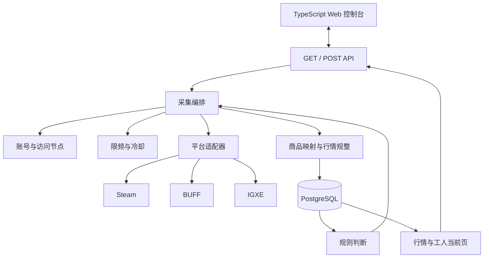

# 系统架构

本文定义 buff-go 的技术架构。产品目标与业务主线见根目录 [README.md](../README.md)，跨平台稳定术语见 [REFERENCE.md](./REFERENCE.md)，Web 操作流程见 [CONSOLE.md](./CONSOLE.md)，平台接口事实见 [`platforms/`](../platforms/README.md)，未完成项见 [`todo.md`](../todo.md)。

## 从启动到可用行情

一次正常运行按以下顺序完成：

1. 单个 Go 进程从 PostgreSQL 恢复采集开关、账号、节点、组合、冷却与方向队列；超时认领回队。
2. 使用者维护节点与账号，把账号绑到节点，然后开启采集。工人路由只看平台和地域。
3. 规划器为已开启且有健康工人的方向往队尾补货；Steam 列表顺带维护标准商品。
4. 空闲健康组合认领入队最早的队头任务；限频按平台与出口 IP 隔离准入。
5. 平台适配器按任务 payload 抓取，每完成一页就把原文、规整行情和 `write_seq` 一起提交。
6. 使用者可以读取最新行情，运行页看到账号加出口 IP 当前在采的方向和当前页商品。
7. 规则命中摘要行情后，系统先检查对应平台与方向的详情能力；已验证并实现时才创建幂等详情任务，否则只记录详情不可用。
8. 关掉方向会停补货并丢掉未完成任务；已写入行情保留。重启后 queued 还在，claimed 超时回队。

## 总体结构



系统采用模块化单体：API、调度、采集、规整和规则运行在同一个进程中。进程内负责执行与短期占用，PostgreSQL 负责需要跨重启保留的业务事实和运行状态。目标架构不使用 Redis。当前生产入口为本地 API 控制面加嵌入控制台，并装配 Steam 摘要常驻采集（BUFF/IGXE 适配器仍受平台证据门约束）。

Web 控制台使用 Vue 3、TypeScript 和 Vite，源码位于根目录 `web/`。构建产物生成到 `internal/webui/dist/` 并嵌入 Go 可执行文件；生产环境不运行 Node 服务。前后端通过同源 GET 查询和 POST 操作接口协作，控制台不直接访问 PostgreSQL，也不直接调用平台接口。

## 模块边界

| 模块 | 只负责什么 | 不负责什么 |
| --- | --- | --- |
| `app` | 启动配置、依赖装配、进程启动与关闭 | 平台业务规则和运行时采集配置 |
| `api` | GET 查询、POST 操作、输入校验 | 直接请求交易平台 |
| `catalog` | Steam 标准商品和平台商品映射 | 行情采集与比较 |
| `market` | bid/ask、金额、数量、时间和状态契约 | HTTP 与持久化实现 |
| `collection` | 方向开关、有序队列补货、工人认领、当前页提交和恢复 | 平台字段解析 |
| `resource` | 账号、节点、组合与运行时占用；采集只校平台与地域 | 具体平台限频数字 |
| `ratelimit` | 按平台隔离的多维度准入与冷却 | 节点生命周期、平台响应解析 |
| `rule` | 读取有效摘要并产生详情任务 | 绕过编排器直接采集 |
| `platform/*` | 登录、请求、分页、响应转换和平台错误识别 | 全局开关、资源分配和规则 |
| `storage/postgres` | 持久化上述领域状态 | 定义业务语义 |
| `telemetry` | 运行状态、失败原因和资源可用性 | 改变业务结果 |
| `webui` | 嵌入并提供已经构建的 Web 静态文件 | 页面业务、数据库访问和采集逻辑 |

接口定义靠近使用方。平台适配器依赖稳定领域契约，领域模块不依赖具体平台、HTTP 客户端或数据库实现。

启动配置只包含 PostgreSQL 连接、监听地址和日志等进程启动必需信息。账号、节点、组合、采集开关、方向队列与限频策略均为运行时状态，统一从 PostgreSQL 读取。

## 采集编排

### 摘要采集

摘要任务由「游戏 + 平台 + 方向」描述。Steam 列表采集顺带维护标准商品。方向开着且存在健康工人时，规划器把队列补到水位 100；工人从能干的方向领队头。关闭后返回的数据不得发布为当前行情。

每一页是最小提交单元：页面响应经过商品映射、币种和字段语义校验后再进入当前行情。后续页面失败不会回滚已提交页。当前页每方向只留最新一页。

当前行情以“Steam 标准商品 + 平台 + 方向”唯一定位。存储层分别保存最新采集尝试和最近有效价格：显式 `empty`、`unavailable` 或 `failed` 可以成为最新尝试状态，但旧价格只保留为带时间的历史值。页面失败只影响已经明确尝试的商品，不得把未覆盖商品批量标成失败或为空。

每个方向的开关版本和 `write_seq` 单调递增。发布当前行情时必须同时校验 `(switch_version, write_seq)`；已关闭版本或较旧序号可以保留为诊断证据，但不能覆盖较新的最新尝试或有效价格。

### 详情采集

详情任务只能由明确规则触发，并固定平台、Steam 标准商品和 bid/ask 方向。创建前必须确认该“平台 + 方向”的详情接口已经验证且适配器已经实现；否则只保存规则命中并标记 `detail_unavailable`。相同规则版本与摘要版本不能重复创建同一任务。

详情分页同样逐页提交。中断后保留已完成订单，但部分快照不能覆盖最近一次完整快照，也不能被读取端解释为完整订单簿。

### 停止与重新开启

关闭一个摘要方向时，规划器停止补货，丢掉该方向未完成任务，推进 `switch_version`，补货游标归零，并先把实际状态设为 `stopping`。队列清空且占用释放后才是 `stopped`；已写入行情和 `write_seq` 继续保留。关闭某一游戏或某一方向不影响其他游戏或其他平台方向。

再次开启后从空队列和归零的补货游标重新补货。重启不推倒方向：`queued` 还在，超时的 `claimed` 回队，规划继续用 `refill_cursor`。

## 资源与限频

访问节点：本机或代理；属性含时效（长效 / 短效）与地域（国内 / 国外 / 香港）。本机也必须声明地域。有效期内出口 IP 不变；验证并记录出口 IP 与 `valid_until`。短效由多代理商按地域水位自动补货；出口探测失败后排空再丢弃。

### 工人路由

组合 = 账号绑到节点。采集前只校验：账号可用、节点可用、节点地域允许该平台（Steam=国外站 → 仅 foreign/hongkong；BUFF/IGXE=国内站 → 仅 domestic/hongkong）。

不配置并行数字。并发 = 健康工人数。工人认领一条、采完、再领；同一账号同时只打一枪。不同平台可并行使用同一节点（各自限流、各自地域规则）。

### 限频

键均带平台：平台总预算、接口、账号、平台+出口 IP、平台+账号+出口 IP。禁止跨平台共用裸 IP 桶。同平台多节点同出口共享该平台 IP 预算。Steam 的 429 不得写入其他平台。缺少必需策略则 `blocked`。

节点 `validating` / `unavailable` 时，绑在该节点上的工人不得领任务。限频与冷却、组合和方向队列存 PostgreSQL。

平台接口地域与频率数字见 [`platforms/<platform>/`](../platforms/README.md)。

## 等待、失败与恢复

已启用但队列未到补货拍或工人都在忙为 `waiting`；无健康工人、冷却或会话失效为 `blocked`。冷却到期或配置变更后自动再判断；登录失效或美元/掉登录须换会话。调度器自身无法维持目标时才 `error`。

临时错误不丢任务；开关仍启用则规划继续补货，工人冷却后再领。Steam 请求须使用 Steam 账号加地域允许国外站的节点，并经该平台限频检查。

## 持久化与恢复

PostgreSQL 保存：

- Steam 标准商品与第三方映射。
- 游戏 × 平台 × 方向开关及版本。
- 平台账号；访问节点（时效、地域、出口验证）。
- 账号与节点的执行组合。
- 按平台隔离的限频与冷却。
- 方向队列、补货游标、`write_seq`、当前页与行情。

认领写在队列表里；重启后 queued 还在，超时 claimed 回队。会话与代理认证明文入库，查询脱敏。`platforms/private/` 仅开发探测。

## 控制面交付

后端默认本机回环。GET/POST 管理开关、账号、节点、组合、工人当前页与行情。短周期 GET 轮询实际状态。见 [CONSOLE.md](./CONSOLE.md)。

回环地址不是完整安全边界。后端必须校验允许的 `Host`，浏览器 POST 必须使用 `application/json`、同源 `Origin` 和 CSRF 令牌；不开放跨域响应，所有 GET 都无业务副作用。Web 静态资源只从自身提供，使用严格 CSP 并禁止第三方脚本。账号会话和代理认证信息永不通过查询接口回显。这些要求属于首版本地控制面，不推迟到远程访问阶段。

首个同源安全上下文 GET 创建短期浏览器控制会话，设置 `HttpOnly`、`SameSite=Strict` 会话 Cookie，并返回与该会话绑定、带过期时间的 CSRF 令牌。Web 客户端只通过专用请求头提交令牌，统一生成的客户端负责注入；会话过期或进程重启后重新获取。缺失、错误、过期或与会话不匹配的令牌全部拒绝。安全上下文的创建不改变任何业务数据。

第一条真实 API 出现时，在根目录 `api/openapi.yaml` 保存契约并完成 Go 实现与契约测试。建立真实 Web 工程后，再从该契约生成 TypeScript 客户端到 `web/src/api/generated/`；前端不手写一套与后端分离的请求类型。该纵向功能只有在真实页面接通后才算整体完成。

`internal/webui/dist/` 是由前端构建产生且被 Git 忽略的目录，不提交构建产物。引入 `go:embed` 后，干净工作区的固定验证顺序是：安装锁定的前端依赖、执行类型检查与前端构建，再执行 Go 测试和编译，避免缺少静态文件导致嵌入失败。

## 目标目录

```text
cmd/buffgo/
api/
  openapi.yaml
internal/
  app/
  api/
  catalog/
  market/
  collection/
  resource/
  ratelimit/
  rule/
  platform/
    steam/
    buff/
    igxe/
  storage/postgres/
    migrations/
  telemetry/
  webui/
    embed.go
    dist/
web/
  src/
    api/generated/
  package.json
docs/
platforms/
testdata/
```

`internal/storage/postgres/migrations/` 保存由该包嵌入并执行的 PostgreSQL 迁移 SQL。`internal/platform/` 保存平台适配器源码；根目录 `platforms/` 保存接口调查资料和开发探测会话，两者不能混放，且 `platforms/` 中的会话不是运行时账号来源。当前生产入口装配 Steam 摘要常驻采集；BUFF/IGXE 适配器仍受平台证据门约束，进度见 [`todo.md`](../todo.md)。

目标目录只在出现真实实现时创建。禁止为了“看起来完整”提前建立空包、空构建目录、占位页面或伪造接口；每次迁移只处理一个能够独立验证的业务切片。
